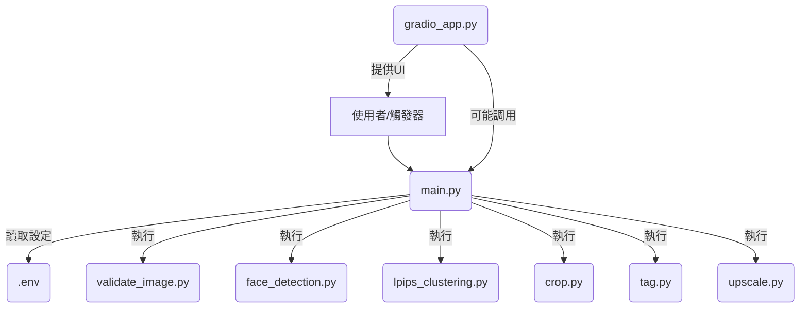
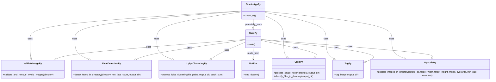

# 技術規格文件

## 1. 總覽

本文件詳細說明了圖像自動化預處理專案的技術規格，包括系統架構、模組功能、API 定義（若適用）以及模組間的關係。

## 2. 系統架構

專案採用模組化架構，每個核心功能由一個獨立的 Python 模組實現。`main.py` 作為中央協調器，根據設定檔 (`.env`) 的配置，依序調用各個處理模組。

## 3. 模組詳細說明

### 3.1. `main.py`
    - **功能**: 專案主入口，負責解析環境變數，按順序調用其他處理模組。
    - **輸入**: `.env` 檔案中的設定。
    - **輸出**: 處理後的圖像（根據各模組設定輸出到指定目錄），控制台日誌。
    - **依賴**: `dotenv`, `validate_image`, `face_detection`, `lpips_clustering`, `crop`, `tag`, `upscale`。

### 3.2. `validate_image.py`
    - **功能**: 驗證指定目錄下的圖像檔案是否完整有效，移除損壞或無法開啟的圖像。
    - **輸入**: 圖像目錄路徑。
    - **輸出**: 清理後的圖像目錄，控制台日誌。
    - **主要函式**: `validate_and_remove_invalid_images(directory)`
    - **演算法**: 嘗試使用圖像庫（如 Pillow）開啟圖像，捕獲異常。

### 3.3. `face_detection.py`
    - **功能**: 偵測圖像中的人臉，可設定篩選條件（如最小人臉數量），將符合條件的圖像複製到指定輸出目錄。
    - **輸入**: 圖像目錄路徑，最小人臉數量，輸出目錄路徑。
    - **輸出**: 包含符合條件人臉圖像的目錄，控制台日誌。
    - **主要函式**: `detect_faces_in_directory(directory, min_face_count, face_output_directory)`
    - **演算法**: 可能使用基於深度學習的人臉偵測模型（如 ONNX 格式的模型）。

### 3.4. `lpips_clustering.py`
    - **功能**: 使用 LPIPS (Learned Perceptual Image Patch Similarity) 計算圖像間的感知相似度，並進行聚類，以識別和移除重複或高度相似的圖像。
    - **輸入**: 圖像檔案路徑列表，輸出目錄路徑，批次大小。
    - **輸出**: 包含去重後圖像的目錄（或標記檔案），控制台日誌。
    - **主要函式**: `process_lpips_clustering(file_paths, lpips_output_directory, lpips_batch_size)`
    - **演算法**: LPIPS 模型，聚類演算法（如 DBSCAN 或基於閾值的簡單去重）。

### 3.5. `crop.py`
    - **功能**: 根據人臉偵測結果或其他圖像特徵，將圖像裁切成不同視角或尺寸（如全身、半身、頭像）。並能將裁切後的檔案分類到不同資料夾。
    - **輸入**: 圖像目錄路徑，輸出目錄路徑。
    - **輸出**: 包含裁切後圖像的目錄結構，控制台日誌。
    - **主要函式**: `process_single_folder(directory, output_directory)`, `classify_files_in_directory(output_directory)`
    - **演算法**: 圖像裁切邏輯，可能依賴人臉偵測結果的邊界框。

### 3.6. `tag.py`
    - **功能**: 自動為圖像生成描述性標籤（tags）。這些標籤可用於圖像檢索或作為 AI 模型訓練的條件輸入。
    - **輸入**: 圖像目錄路徑。
    - **輸出**: 標籤檔案（如 text 檔案，與圖像同名），控制台日誌。
    - **主要函式**: `tag_image(output_directory)`
    - **演算法**: 可能使用預訓練的圖像標記模型（如 DeepDanbooru 或類似的 ONNX 模型）。

### 3.7. `upscale.py`
    - **功能**: 使用超解析度模型放大圖像，提升圖像品質。可設定目標尺寸和最小處理尺寸。
    - **輸入**: 圖像目錄路徑，目標寬度，目標高度，超解析度模型名稱，是否覆寫，最小處理尺寸，是否遞迴處理子目錄。
    - **輸出**: 包含放大後圖像的目錄，控制台日誌。
    - **主要函式**: `upscale_images_in_directory(output_directory, target_width, target_height, model, overwrite, min_size, recursive)`
    - **演算法**: 使用 Waifuc 庫或其他庫中實現的超解析度模型（如 Real-ESRGAN, Waifu2x 等）。

### 3.8. `gradio_app.py`
    - **功能**: 提供一個基於 Gradio 的 Web 使用者介面，讓使用者可以透過瀏覽器上傳圖像、調整參數並執行圖像處理流程。
    - **目前狀態**: 已實現完整功能，包含各獨立處理模組的頁籤、整合式處理流程以及豐富的使用者互動功能。
    - **已實現的功能**:
        - **全面的參數控制整合**: 自動從 `.env` 讀取預設值，在 UI 中提供所有關鍵參數的控制項，包括路徑設定、模型選擇、數值參數等。
        - **即時進度顯示**: 使用 `gr.Progress()` 為所有處理函數提供即時進度更新和狀態描述。
        - **視覺化結果預覽**: 在人臉檢測、圖像裁切、圖像放大等功能中使用 `gr.Gallery` 顯示處理結果的樣本圖像。
        - **整合式處理流程頁籤**: 提供統一介面讓使用者選擇處理步驟、配置參數並執行完整的預處理管線。
        - **優化的使用者體驗**: 清晰的標籤、說明文字、合理的預設值、分組的參數控制等。
    - **輸入**: 使用者透過 UI 輸入的路徑、參數和處理選項。
    - **輸出**: 在 UI 上顯示處理結果、進度更新和圖像預覽。
    - **主要函式**: 
        - `run_integrated_pipeline()`: 執行整合式處理流程
        - `run_validation()`, `run_face_detection()`, `run_lpips()`, `run_crop()`, `run_classify()`, `run_tag()`, `run_upscale()`: 各獨立處理模組的UI包裝函數
        - `build_interface()`: 建構完整的 Gradio UI 介面
    - **輸出**: 在 UI 上顯示處理結果，提供下載連結。
    - **依賴**: `gradio`, 以及所有核心處理模組。

### 3.9. `logger_config.py`
    - **功能**: 提供統一的日誌系統配置和管理，支援結構化的日誌記錄和檔案輸出。
    - **輸入**: 環境變數中的日誌配置參數。
    - **輸出**: 配置好的日誌記錄器實例。
    - **主要類別和函式**: 
        - `LoggerConfig`: 日誌配置管理類別
        - `get_logger(name)`: 獲取配置好的日誌記錄器
    - **功能特性**:
        - 支援多級別日誌記錄 (DEBUG, INFO, WARNING, ERROR, CRITICAL)
        - 同時輸出到控制台和檔案
        - 按模組名稱和日期自動組織日誌檔案
        - 為錯誤日誌建立專用檔案
        - 透過環境變數可配置日誌行為
        - UTF-8 編碼支援中文日誌
    - **環境變數配置**:
        - `LOG_LEVEL`: 日誌級別 (預設: INFO)
        - `LOG_TO_FILE`: 是否輸出到檔案 (預設: true)
        - `LOG_DIRECTORY`: 日誌檔案目錄 (預設: logs)
        - `LOG_FORMAT`: 日誌格式字串 (可自訂)

### 3.10. `error_handler.py`
    - **功能**: 提供統一的錯誤處理系統，包含專案自定義異常類別和安全執行包裝函數。
    - **主要類別**: 
        - `WaifucError`: 專案基礎異常類別
        - `DirectoryError`: 目錄相關錯誤
        - `ImageProcessingError`: 圖像處理相關錯誤
        - `ModelError`: 模型載入或執行錯誤
        - `ConfigurationError`: 配置錯誤
    - **主要函式**: 
        - `safe_execute(func, *args, **kwargs)`: 安全執行包裝函數，提供統一的錯誤處理邏輯
        - `validate_directory(path)`: 驗證目錄是否存在和可存取
        - `get_user_friendly_error_message(error)`: 將技術錯誤轉換為友好的使用者訊息
    - **功能特性**:
        - 統一的異常處理機制，所有模組都使用相同的錯誤類型
        - 自動日誌記錄，包含錯誤詳情和堆疊追蹤
        - 友好的錯誤訊息，將技術術語轉換為使用者可理解的說明
        - 安全執行包裝，防止單一處理失敗影響整個流程
        - 支援預設返回值，確保程式穩定性
    - **整合狀態**: 已完全整合到所有核心模組中，包括 `validate_image.py`, `face_detection.py`, `lpips_clustering.py`, `crop.py`, `upscale.py`, `tag.py`

## 4. API 定義 (若適用)

目前專案主要透過腳本執行，若未來發展成服務，可考慮提供 RESTful API。

**範例 API 端點 (假設):**

*   `POST /preprocess_image`
    *   請求體: `{ "image_url": "...", "config": { ... } }`
    *   回應: `{ "status": "success", "output_url": "..." }`

## 5. 模組關係圖 (Mermaid)

## 6. 資料庫設計 (若適用)

目前專案不直接使用資料庫，圖像和標籤以檔案系統形式儲存。若未來需要更複雜的資料管理，可考慮引入 SQLite 或其他資料庫。

## 7. 環境變數 (`.env` 檔案範例)

\`\`\`
directory="h:/path/to/your/images"
face_output_directory="face_out"
min_face_count=1
lpips_output_directory="lpips_output"
lpips_batch_size=50
output_directory="cropped_and_upscaled"
upscale_target_width=1024
upscale_target_height=1024
upscale_model="HGSR-MHR-anime-aug_X4_320"
upscale_min_size=800

enable_validation="true"
enable_face_detection="true"
enable_lpips_clustering="true"
enable_cropping="true"
enable_classification="true"
enable_upscaling="true"
enable_tagging="true"

# 日誌系統設定
LOG_LEVEL="INFO"
LOG_TO_FILE="true"
LOG_DIRECTORY="logs"
LOG_FORMAT="%(asctime)s - %(name)s - %(levelname)s - %(funcName)s:%(lineno)d - %(message)s"
\`\`\`
